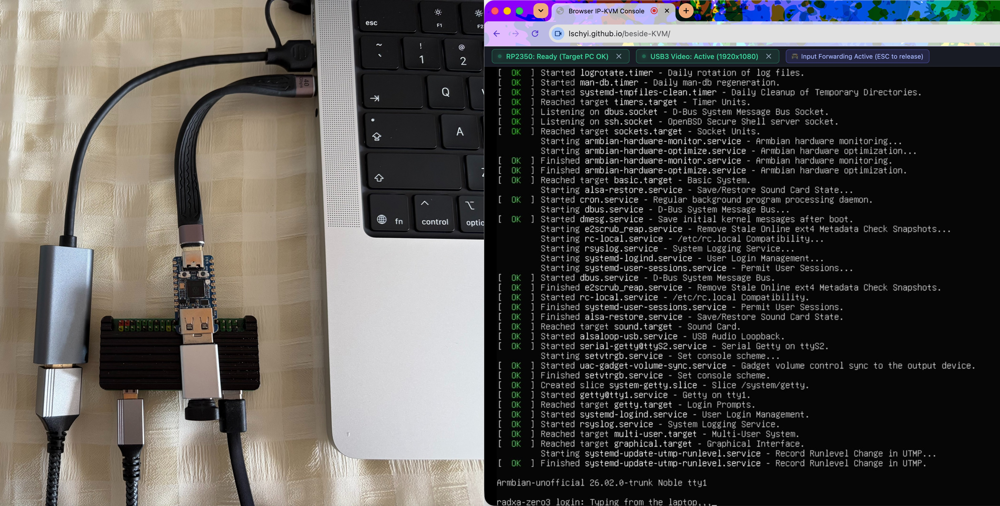

# Beside KVM

[Try it out here](https://lschyi.github.io/beside-KVM/)



This is a web based KVM solution. Just like other IP-KVMs, you have a laptop
that has a screen display contents, has a keyboard/mouse for interacting the
system.

You can view another PC's screen from your laptop, use the keyboard/mouse
connect on your laptop to control another PC.

Unlike the IP-KVMs, you will need WiFi/Ethernet cable connect to the IP-KVM,
also another power supply for the IP-KVM, you just connect 2 USB devices to
your laptop.

```
 ┌────────────────────────────────────────────────────────┐
 │                         Laptop.                        │
 │  ┌──────────────────────────────────────────────────┐  │
 │  │              Browser / static HTML               │  │
 │  │  • View video output of Target PC                │  │
 │  │  • Send keyboard/mouse event to control target PC│  │
 │  └────────┬─────────────────────────┬───────────────┘  │
 └───────────┬─────────────────────────┬──────────────────┘
             │ USB cable               │ USB cable 
             ▼                         ▼
 ┌────────────────────────┐     ┌─────────────────────┐
 │  RP2350 (Input Bridge) │     |   USB capture card  |
 └────────────────────────┘     └─────────────────────┘
             │ USB cable               │ HDMI cable 
             ▼                         ▼
 ┌────────────────────────────────────────────────────────┐
 │                      Target PC                         │
 └────────────────────────────────────────────────────────┘
```
